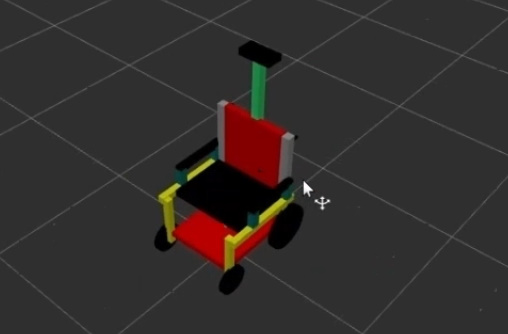
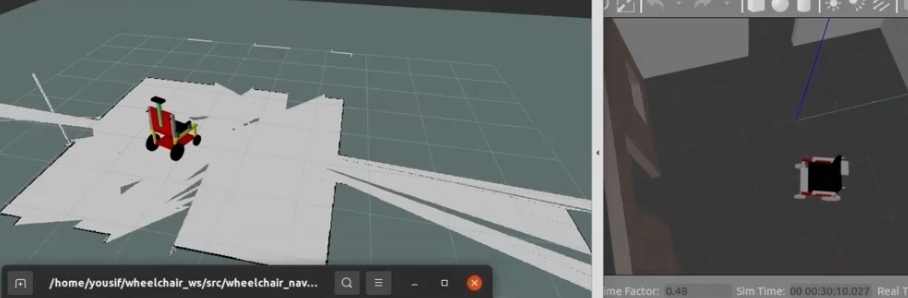
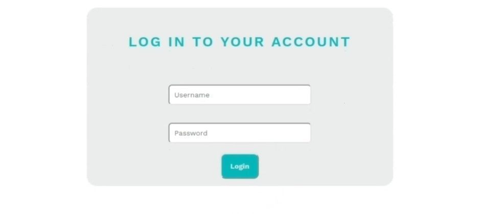
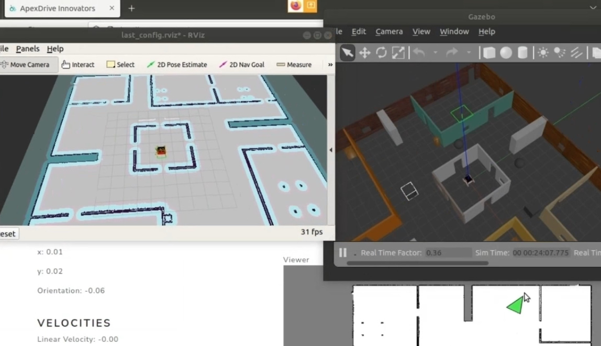
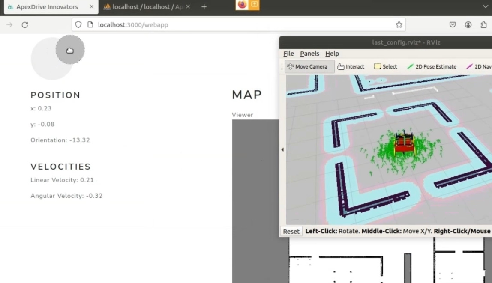
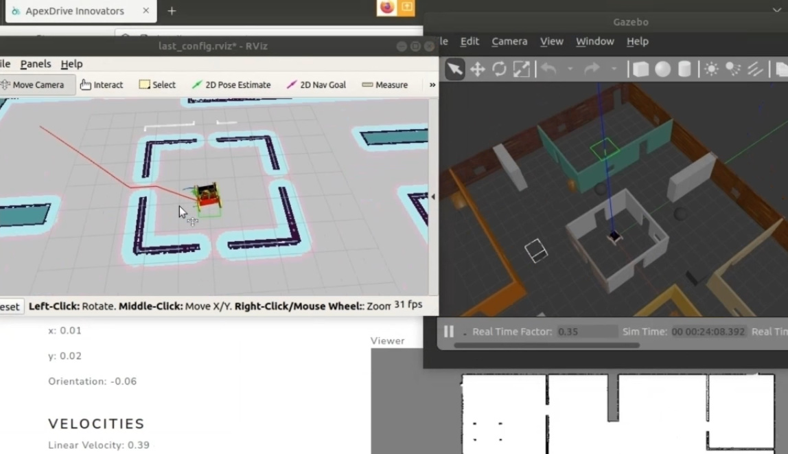
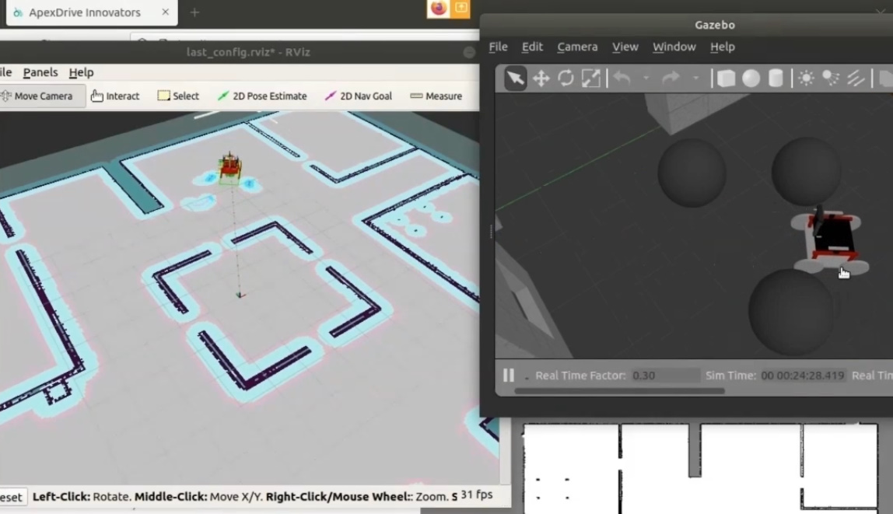

# 🦽 Self-Driving Wheelchair (Graduation Project)

This project is my **graduation project** developed as part of a **team of five members**.  
It focuses on building an **autonomous self-driving wheelchair** using **ROS (Robot Operating System)**, **SLAM**, and multiple sensors (**Kinect & LIDAR**) to enable **autonomous navigation and obstacle avoidance**.

The system was successfully tested in both **simulation (Gazebo)** and **real-world environments**.

The project is proudly sponsored by the **Information Technology Industry Development Agency (ITIDA)**.

---

# 🏆 Achievements

Our project participated in **three national competitions**:

- **Made In Egypt (MIE)**
- **Egypt Industry 4.0 Challenge**
- **IEEE IC-SIT 2024**

We successfully reached the **finals of IEEE IC-SIT 2024**, and the project received an **A\* (Excellent)** evaluation for its outstanding implementation and performance.

---

# 🏗️ Project Architecture

The project consists of three main components.

## 1️⃣ Robotics System (Control & Navigation)

Responsible for the **core autonomous functionality of the wheelchair**.

Main components:

- **ROS (Robot Operating System)** for communication between sensors and actuators
- **SLAM** for localization and mapping
- **Sensor Integration**
  - **LIDAR**
  - **Kinect**
- **Navigation Algorithms**
  - **A\*** – Global path planning
  - **DWA (Dynamic Window Approach)** – Local obstacle avoidance
- **Robot State Monitoring**
  - Position (x, y)
  - Orientation
  - Velocity

---

## 2️⃣ Web Application (Robot Control Interface)

A **React-based web interface** that allows users to monitor and control the wheelchair remotely.

Main features:

- **Connection Component**
  - Shows robot connection status using **ROS WebSocket**

- **Teleoperation Component**
  - **Virtual joystick** to manually control the wheelchair

- **Robot State Component**
  - Displays real-time robot data such as:
    - Position
    - Velocity
    - Orientation

- **Map Component**
  - Displays the generated map
  - Allows users to **set navigation goals**

- **Login System**
  - Secure access to the control interface

---

## 3️⃣ Simulation Environment (Gazebo)

The wheelchair was first tested in **Gazebo simulation** before deployment in the real world.

Simulation allowed us to:

- Test **navigation algorithms**
- Verify **SLAM performance**
- Simulate **dynamic obstacles**
- Tune **MoveBase parameters**

---

# 🖼️ Screenshots

## URDF Robot Model

## Environment Mapping

## Web Application Login Page

## React Web App – Setting Navigation Goal

## Virtual Joystick Teleoperation

## Autonomous Path Planning

## Dynamic Obstacle Avoidance

---

# ⚙️ Technologies Used

### Robotics

- **ROS Noetic**
- **Gazebo**
- **RViz**
- **SLAM**
- **MoveBase**
- **A\* Global Planner**
- **DWA Local Planner**
- **URDF / Xacro**

### Web Application

- **React.js**
- **Node.js**
- **ROSBridge / WebSocket**
- **JavaScript**
- **HTML5**
- **CSS3**

### Programming Languages

- **Python**
- **JavaScript**

---

# 🎥 Demo

Watch the **live demonstration of the Self-Driving Wheelchair**:

🔗  
https://www.linkedin.com/posts/youssef-adel-a601641b1_apexdriveinnovators-ros-selfdrivingwheelchair-activity-7219724350126514176-cSIV?utm_source=share&utm_medium=member_desktop&rcm=ACoAADFSougBbplLvCFvoq2oVcM3uoEe_eK2zig

---

# 🙏 Acknowledgements

This project was completed as part of our **graduation project**.

Special thanks to:

**Eng. Hesham Gamal**  
for his continuous guidance and support throughout the project.

We also thank our faculty members and competition organizers for their valuable support.

---

# 🔗 Related Projects

- 🤖 Autonomous Mobile Robot (Simulation)  
  https://github.com/YoussefAdel170/Autonomous-Mobile-Robot

---

# 📜 License

This project is licensed under the **MIT License**.  
See the [LICENSE](./LICENSE) file for details.

---

# 👨‍💻 Author

**Youssef Adel**

🔗 LinkedIn  
https://www.linkedin.com/in/youssef-adel-a601641b1/
